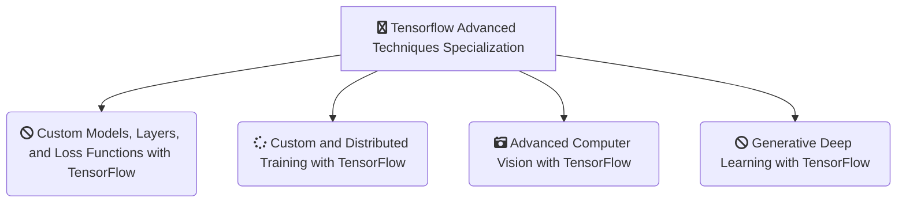

<h1 align="center">
  Tensorflow Advanced Techniques Specialization
</h1>
 

### Table of contents

- [Curriculum](https://github.com/jmcheon/tensorflow-advanced_techniques_specialization/wiki/Curriculum)
  - [Course1 - Custom Models, Layers, and Loss Functions with TensorFlow](https://github.com/jmcheon/tensorflow-advanced_techniques_specialization/tree/main/Course1) (5 Modules)
  - [Course2 - Custom and Distributed Training with TensorFlow](https://github.com/jmcheon/tensorflow-advanced_techniques_specialization/tree/main/Course2) (4 Modules)
  - [Course3 - Advanced Computer Vision with TensorFlow](https://github.com/jmcheon/tensorflow-advanced_techniques_specialization/tree/main/Course3) (4 Modules)
  - [Course4 - Generative Deep Learning with TensorFlow](https://github.com/jmcheon/tensorflow-advanced_techniques_specialization/tree/main/Course4) (4 Modules)

## About this Specialization

### Course1 - Custom Models, Layers, and Loss Functions with TensorFlow

- Module1 - Functional APIs
- Module2 - Custom Loss Functions
- Module3 - Custom Layers
- Module4 - Custom Models
- Module5 - Bonus Content - Callbacks

### Course2 - Custom and Distributed Training with TensorFlow

- Module1 - Differentiation and Gradients
- Module2 - Custom Training
- Module3 - Graph Mode
- Module4 - Distributed Training

### Course3 - Advanced Computer Vision with TensorFlow

- Module1 - Introduction to Computer Vision
- Module2 - Object Detection
- Module3 - Image Segmentation
- Module4 - Visualization and Interpretability

### Course4 - Generative Deep Learning with TensorFlow

- Module1 - Style Transfer
- Module2 - AutoEncoders
- Module3 - Variational AutoEncoders
- Module4 - GANs

## Certificates

[Tensorflow Advanced Techniques Specialization](https://coursera.org/share/4957c131f41c969da154b9304f946513) (Apr 20, 2025)

- [Course1 - Custom Models, Layers, and Loss Functions with TensorFlow](https://www.coursera.org/account/accomplishments/certificate/S47BV7I1MWUS) (Jan 12, 2025)
- [Course2 - Custom and Distributed Training with TensorFlow](https://www.coursera.org/account/accomplishments/certificate/3SO1J52TS8XC) (Feb 2, 2025)
- [Course3 - Advanced Computer Vision with TensorFlow](https://www.coursera.org/account/accomplishments/certificate/OD0HDYQ7OFSS) (Mar 30, 2025)
- [Course4 - Generative Deep Learning with TensorFlow](https://www.coursera.org/account/accomplishments/certificate/OD0HDYQ7OFSS) (Apr 20, 2025)

## References

[Tensorflow Advanced Techniques Specialization](https://www.coursera.org/specializations/tensorflow-advanced-techniques)
